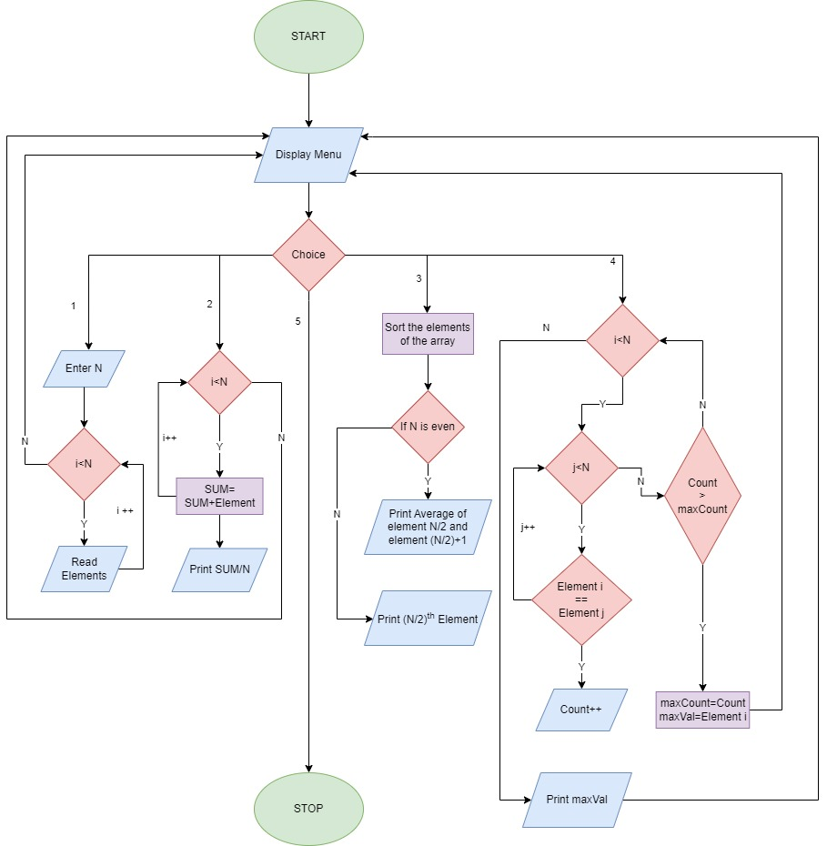

# Question:
```
Create a java program that performs the following operation:

--> The program should collect an integer array from the user

--> After the array is entered, you need to create a menu of items

1) Find the Mean Value
2) Find the Median Value
3) Find the Mode Value

From the user-given array. The program should have a minimum of 3 functions apart from the main function;
Each of the functions implements the Mean, Median, and Mode computation by accepting the array user has entered as a parameter and returning the value as a result.
From the main method, you will display the result.
```

# Flow Chart


## Constraints:
```
--> The input elements cannot be more than 1024.
--> The array can accept only integer and float values.
--> If you choose to display mean, median, mode before giving values to the array then the output may not be as expected.
--> The output will always be a floating point value.
--> If multiple modes are present then the first occurance of the value will be considered.
```

## Rules:
```
--> To compile the program, type "javac Lab3.java".
--> To run the program, type "java Lab3"
```

## Expected Output:
```
=============================================
-----------------WELCOME!--------------------
=============================================
=============================================
Please choose from the following:
1) Enter the values:
2) Find Mean:
3) Find Median
4) Find Mode  
5) Exit:
=============================================
Please enter your choice:1
=============================================
How many values you want to enter?:5
Enter value 1:140
Enter value 2:26.01
Enter value 3:1
Enter value 4:44
Enter value 5:1
=============================================
Please choose from the following:
1) Enter the values:
2) Find Mean:
3) Find Median
4) Find Mode
5) Exit:
=============================================
Please enter your choice:2
=============================================
=============================================
Mean of the values is 42.402
=============================================
=============================================
Please choose from the following:
1) Enter the values:
2) Find Mean:
3) Find Median
4) Find Mode
5) Exit:
=============================================
Please enter your choice:3
=============================================
=============================================
Median of the values is 26.01
=============================================
=============================================
Please choose from the following:
1) Enter the values:
2) Find Mean:
3) Find Median
4) Find Mode
5) Exit:
=============================================
Please enter your choice:4
=============================================
=============================================
Mode of the values is 1.0
=============================================
=============================================
Please choose from the following:
1) Enter the values:
2) Find Mean:
3) Find Median
4) Find Mode
5) Exit:
=============================================
Please enter your choice:1
=============================================
How many values you want to enter?:6
Enter value 1:1
Enter value 2:2
Enter value 3:3
Enter value 4:11
Enter value 5:11
Enter value 6:1
=============================================
Please choose from the following:
1) Enter the values:
2) Find Mean:
3) Find Median
4) Find Mode
5) Exit:
=============================================
Please enter your choice:3
=============================================
=============================================
Median of the values is 2.5
=============================================
=============================================
Please choose from the following:
1) Enter the values:
2) Find Mean:
3) Find Median
4) Find Mode
5) Exit:
=============================================
Please enter your choice:4
=============================================
=============================================
Mode of the values is 1.0
=============================================
=============================================
Please choose from the following:
1) Enter the values:
2) Find Mean:
3) Find Median
4) Find Mode
5) Exit:
=============================================
Please enter your choice:2
=============================================
=============================================
Mean of the values is 4.8333335
=============================================
=============================================
Please choose from the following:
1) Enter the values:
2) Find Mean:
3) Find Median
4) Find Mode
5) Exit:
=============================================
Please enter your choice:5
=============================================
=============================================
----------------Thank You!-------------------
=============================================
```