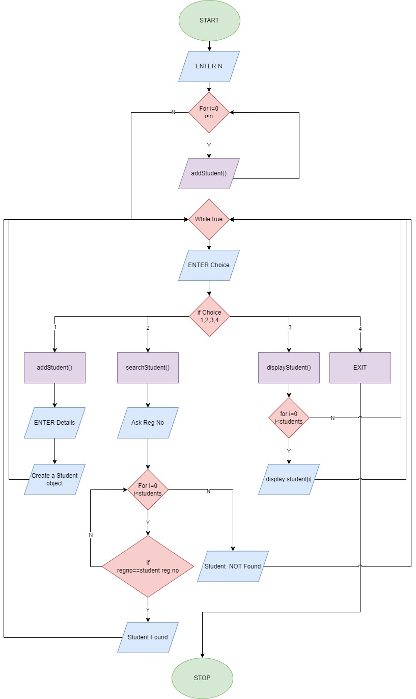

# Question:
```
Create a student class, that will store the details of the Student
Reg. No.
Name
Email
Phone
Class
Department
The class will have a constructor to initialize the values of the Student and a method to print the Details of the Student.

In the main-method class, create an array of Student Class to hold maximum details of 100 Students.
In the menu-driven program, the menu options will have
Add a student
Adds the details of 1 student to the array of Student
Search for a student
Search for the details of a student from the array of Student
(Optional) Searching can be done with Name & Register Number
Display all students
Displays the details of all students
Note: Make use of functions to implement the menu options

Extension (Optional):
Save the details of each student in a file, with his name with the help of a method in student class, when the student is getting created.
```

# Flow Chart



```
Will Update in sometime!
And
File part also will do in sometime! (Because it is optional)
```

## How to Run the program:
```
--> To compile the program, type "javac Lab5.java".
--> To run the program, type "java Lab5"
```

## Constraints:
```
--> The program does not handle exceptions, so need to take care while entering user input.
--> You cannot enter integer 2 as string 'two'
```

## Sample Output:
```
==========================================================
How many students you want to add? : 2
==========================================================
===============Enter details for student 1:===============
==========================================================
Registration Number: 22122140
Name: Karan
Email: punjabi.karan@msds.christuniversity.in
Phone Number: 7405387209
Class: 2MScDS-B
Department: Data Science
==========================================================
===============Enter details for student 2:===============
==========================================================
Registration Number: 22122103
Name: Akshay
Email: akshay.gangadhar@msds.christuniversity.in
Phone Number: 9976587678
Class: 2MScDS-B
Department: Data Science
==========================================================
===========================MENU===========================
1. Add a new student.
2. Search a student.
3. Display all students.
4. Exit.
==========================================================
Enter your choice: 3
==========================================================
----------------------Student Details----------------------
-------------------------------------------------------------------------------------------------------------------------------------------
Registration Number       Name            Email                                              Phone Number Class      Department     
-------------------------------------------------------------------------------------------------------------------------------------------
22122140                  Karan           punjabi.karan@msds.christuniversity.in             7405387209   2MScDS-B   Data Science   
-------------------------------------------------------------------------------------------------------------------------------------------
22122103                  Akshay          akshay.gangadhar@msds.christuniversity.in          9976587678   2MScDS-B   Data Science   
-------------------------------------------------------------------------------------------------------------------------------------------
===========================MENU===========================
1. Add a new student.
2. Search a student.
3. Display all students.
4. Exit.
==========================================================
Enter your choice: 2
==========================================================
====================Search a student=======================
Registration Number: 22122103
Name: AkshAY
==========================================================
The student with registration number 22122103 and name AkshAY is present.
==========================================================
===========================MENU===========================
1. Add a new student.
2. Search a student.
3. Display all students.
4. Exit.
==========================================================
Enter your choice: 2
==========================================================
====================Search a student=======================
Registration Number: 22122153
==========================================================
The student with registration number 22122153 is not present!
===========================MENU===========================
1. Add a new student.
2. Search a student.
3. Display all students.
4. Exit.
==========================================================
Enter your choice: 2  
==========================================================
====================Search a student=======================
Registration Number: 22122140
Name: Punjabi
==========================================================
Name does not match!
==========================================================
===========================MENU===========================
1. Add a new student.
2. Search a student.
3. Display all students.
4. Exit.
==========================================================
Enter your choice: 1
==========================================================
===============Enter details for student 3:===============
==========================================================
Registration Number: 22122153
Name: Subhramanya
Email: subhramanya.patil@llb.christuniversity.in
Phone Number: 8789654376
Class: 2LLB-A
Department: LAW
==========================================================
===========================MENU===========================
1. Add a new student.
2. Search a student.
3. Display all students.
4. Exit.
==========================================================
Enter your choice: 3
==========================================================
----------------------Student Details----------------------
-------------------------------------------------------------------------------------------------------------------------------------------
Registration Number       Name            Email                                              Phone Number Class      Department     
-------------------------------------------------------------------------------------------------------------------------------------------
22122140                  Karan           punjabi.karan@msds.christuniversity.in             7405387209   2MScDS-B   Data Science   
-------------------------------------------------------------------------------------------------------------------------------------------
22122103                  Akshay          akshay.gangadhar@msds.christuniversity.in          9976587678   2MScDS-B   Data Science   
-------------------------------------------------------------------------------------------------------------------------------------------
22122153                  Subhramanya     subhramanya.patil@llb.christuniversity.in          8789654376   2LLB-A     LAW
-------------------------------------------------------------------------------------------------------------------------------------------
===========================MENU===========================
1. Add a new student.
2. Search a student.
3. Display all students.
4. Exit.
==========================================================
Enter your choice: 2
==========================================================
====================Search a student=======================
Registration Number: 22122153
Name: subhramanya
==========================================================
The student with registration number 22122153 and name subhramanya is present.
==========================================================
===========================MENU===========================
1. Add a new student.
2. Search a student.
3. Display all students.
4. Exit.
==========================================================
Enter your choice: 4
==========================================================
```