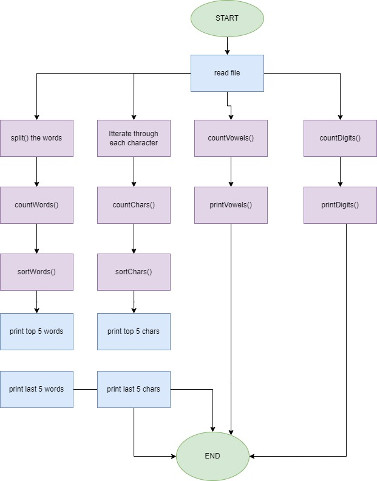

# Question:
```
Write a JAVA program that reads a file (text file) and finds the following details.
Vowels and their count. Eg: [a:100, e:45, I:55, ..]
Digits and their count. Eg: [0:1000, 1:10, 2:40, ...]
Top Five repeated words and their count.
Least Five repeated words and their count.
Top Five repeated characters and their count.
Least FIve repeated characters and their count.

Note:
Use the file attached.
Use functions to implement the six functions asked.
Pass the file content to the functions and return the values accordingly.
No Global variables are allowed to be used.

Additional Task [htmlFile.txt]:
You have been given an HTML file; from the HTML File, identify the Top categories, display it to the user, and write the content to the file.
```


## How to Run the program:
```
--> To compile the program, type "javac Lab6.java".
--> To run the program, type "java Lab5"
```

## Flow Chart


## Sample Output:
```
=======================================================================
=======================================================================
Vowels:
=======================================================================
A --> 357
E --> 504
I --> 360
O --> 260
U --> 107
=======================================================================
Digits:
=======================================================================
0 --> 6
1 --> 6
2 --> 7
3 --> 4
4 --> 2
5 --> 4
6 --> 2
7 --> 4
8 --> 2
9 --> 0
=======================================================================
Top 5 Repeated Words:
=======================================================================
and 34
of 32
the 25
to 25
In 16
=======================================================================
Last 5 Repeated Words:
=======================================================================
continued 1
technological 1
advancements 1
efficiency 1
reliability 1
=======================================================================
Top 5 Repeated Chars:
=======================================================================
e 504
i 360
a 357
t 337
n 334
=======================================================================
Last 5 Repeated Chars:
=======================================================================
6 2
z 2
4 2
8 2
j 2
=======================================================================
=======================================================================
===============================PART 2==================================
=======================================================================
Top Categories

1) Explained News
2) Political Pulse
3) Latest Opinion
4) Mumbai News
5) Delhi News
6) Pune News
7) Bangalore News
8) Bollywood News
9) Health News
10) India News
11) Sports News
12) Lifestyle News
13) Jobs
14) Mobile &amp; Tabs
15) Tech Reviews
16) Gadgets
17) Mobile &amp; Tabs
18) Food &amp; Wine
19) Elections 2023
20) Fitness

=======================================================================
```